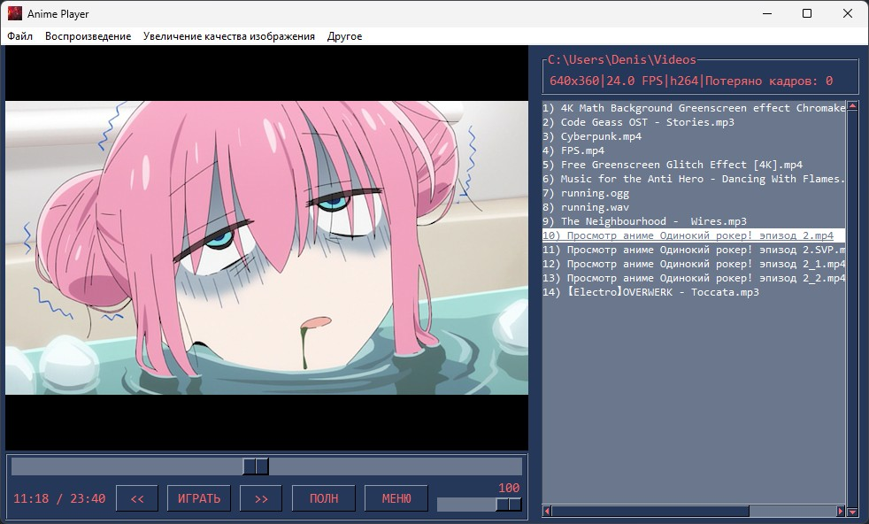
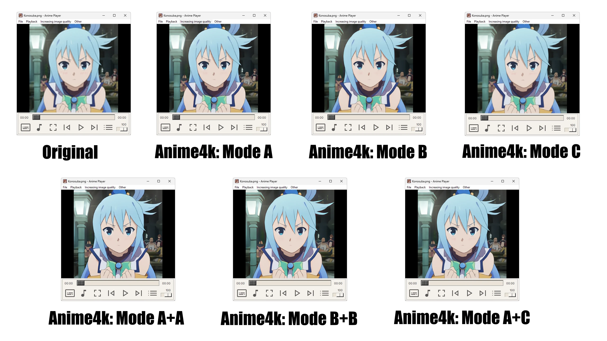

# Anime Player

Video player with the function of improving the quality of the hand-drawn image using the high-performance scaling algorithm of Anime4K.

This program is a video player written in the Python programming language using the GUI library [PySimpleGUI](https://github.com/PySimpleGUI/PySimpleGUI), the media player [mpv](https://mpv.io/) and scaling algorithm [Anime4K](https://github.com/bloc97/Anime4K). Anime Player is designed to play video and audio files and includes functions such as opening files, URLs and folders, setting image scaling parameters using the Anime4K algorithm, creating mpv config for watching videos using the Anime4K algorithm on Android, viewing help and information about tuning the algorithm.
The player also has support for frame interpolation using SVP (to work, you need to install [SVP](https://www.svp-team.com/) and [VapourSynth](https://github.com/vapoursynth/vapoursynth/releases )).
 

Anime4K has 3 major modes, as the small CNN networks cannot learn effectively every type of distribution shift
and degradation seen in the wild. Human judgement will serve (for now) as the stopgap solution. Usually the correct
mode is the one that looks best.

The easiest way is to first visually inspect each mode in the A-B-C order. Mode A has the most visible artifacts of the
three modes if used incorrectly. B and C can be harder to distinguish for lower resolution anime.

If you want increased perceptual quality, use the corresponding secondary mode.

| Primary Mode | Corresponding Secondary Mode |
|--------------|------------------------------|
| A            | A+A                          |
| B            | B+B                          |
| C            | C+A                          |

Видеоплеер с функцией улучшения качества рисованного изображения с помощью высокопроизводительного алгоритма масштабирования Anime4K.

Эта программа представляет собой видеоплеер, написанный на языке программирования Python с использованием библиотеки графического пользовательского интерфейса [PySimpleGUI](https://github.com/PySimpleGUI/PySimpleGUI), мультимедийного проигрывателя [mpv](https://mpv.io/) и алгоритма масштабирования [Anime4K](https://github.com/bloc97/Anime4K). Anime Player предназначен для воспроизведения видео и аудио файлов и включает в себя такие функции, как открытие файлов, URL-адресов и папок, настройка параметров масштабирования изображения с помощью алгоритма Anime4K, создание конфига mpv для просмотра видео с применением алгоритма Anime4K на Android, воспроизведение субтитров, ускорение и замедление видео, переключение аудио дорожек, возможность изменения цветовой темы, восстановление позиции последнего открытого файла, просмотр справки и информации о настройке алгоритма.
Также в плеере есть поддержка интерполяции кадров с помощью SVP (для работы требуется установить [SVP](https://www.svp-team.com/) и [VapourSynth](https://github.com/vapoursynth/vapoursynth/releases)).

 Anime4K есть 3 основных режима, так как небольшие сети CNN не могут эффективно изучать каждый тип смещения распределения
и деградация, наблюдаемая в дикой природе. Человеческое суждение послужит (пока) временным решением. Обычно правильный
режим тот, который выглядит лучше всего.

Самый простой способ - сначала визуально осмотреть каждый режим в порядке A-B-C. Режим A при неправильном использовании имеет наиболее заметные артефакты из
трех режимов. B и C может быть сложнее различить для аниме с более низким разрешением.

Если вы хотите повысить качество восприятия, используйте соответствующий дополнительный режим.

| Основной режим | Соответствующий дополнительный режим |
|----------------|--------------------------------------|
| A              | A+A                                  |
| B              | B+B                                  |
| C              | C+A                                  |
